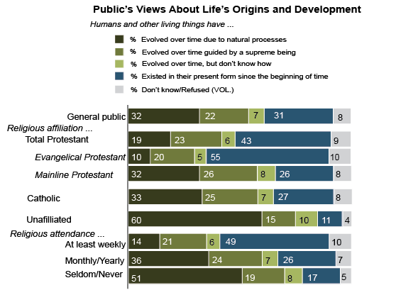
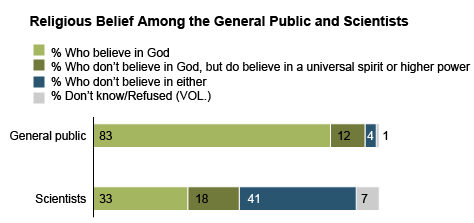

```{r setup, include=FALSE}
knitr::opts_chunk$set(echo = FALSE)
library(haven)
library(dplyr)
library(stringr)
library(purrr)
library(tidyverse)
library(MASS)
library(lmreg)
library(knitr)
```

## Abstract

The relationship between religiosity and acceptance of science is a topic of ongoing debate and investigation. Using data from the General Social Survey, this paper aims to examine the effect of religiosity on trust in science among adults in the United States. An ordinal logistic regression model was trained to predict trust in science based on several predictors, including frequency of attendance to religious services, frequency of prayer, and how fundamentalist the respondent was during adolescence. Results suggest that there is a negative relationship between religiosity and trust in science, with individuals who pray more frequently, show more devotion to the Bible, and were fundamentalist in their adolescence exhibiting lower levels of trust in science. These findings have implications for the promotion of scientific literacy and understanding among religious populations.

## Introduction

In April 2020, President of the American Medical Association Dr. Patrice Harris said in a national address, "In these challenging times, I am addressing the nation to make an appeal for science in defeating this disease" [1]. The conflict between religion and science is a long standing issue in the U.S. but never quite so pertinent as during the COVID-19 pandemic. Belief in science and trust in national medical recommendations meant the difference between weeks of stringent lockdown or tentative freedom. It meant thousands of lives saved or lost. 

Because of the contradictions between current standard teachings of science and traditional readings of the Bible and many other religions’ stories of creation and human existence, it is no surprise that the news often pit the two in a ‘war of faith and science.’ Research on the topic is not sparse. There have been many correlational studies looking at specific relations like religion, religious attendance, and disbelief in evolution, the tendency for scientists to be less religious [2], and high religiosity and negative attitudes towards science [3].

```{r out.width = "49%", fig.show='hold', fig.align='center'}


```

We aimed to add to the conversation with this project by exploring the relationship between religious beliefs and practices and trust in science. With the large scope of the data we used from the General Social Survey, we are able to investigate many facets of religiousness across multiple belief systems and look at their effects both individually and in interaction with each other. With this goal, we used logistic regression to see the individual effect of each factor and how they compare so the findings could be applicable on population trends, not just on an individual level.

This topic is important to understand because with better understanding of how different demographics interact with science, we can approach public education more thoughtfully. Whether it is about diseases like COVID-19, global warming, public health recommendations, or emerging technologies, the language in which it is introduced can be crucial to its acceptance [4].

## Data

The dataset in the project is the 2018 General Social Survey data, made available by NORC at the University of Chicago [5]. The General Social Survey (GSS) has been conducted most years since 1972 as a broad survey across the US containing “a standard core of demographic, behavioral, and attitudinal questions, plus topics of… civil liberties, crime and violence, intergroup tolerance, morality, national spending priorities, psychological well-being, social mobility, and stress and traumatic events” [5]. The breadth of this data allowed for us to consider many variables and focus on those that best answered our question both in interpretation and in statistical significance. For this survey, the data is collected in face-to-face interviews conducted by NORC and imputed by the interviewer for all the questions the respondent, “R” in the codebook,  is able to answer. The value is “NA” for all values the respondent does not or cannot answer.

## Exploratory Data Analysis

```{r data_cleaning}
GSS2018 <- read_sav("GSS2018.sav")

# Create codebook with variable descriptions
n <- ncol(GSS2018)
labels_vector <- map_chr(1:n, function(x) attr(GSS2018[[x]], "label"))
variable_name <- names(GSS2018)
code_book <- data.frame(variable_name, description = labels_vector)

# Filter for religious regex
relig_codebook <- code_book[
  grep("relig|strength of affiliation|god|jew|denomination|fundamentalist|bible|muslim|belief|church|pray",
    labels_vector,
    ignore.case = TRUE
  ),
]

relig_df <- GSS2018 %>%
  dplyr::select(relig_codebook$variable_name)


# Add response to religious df
all_vars <- code_book[
  grep("relig|strength of affiliation|god|jew|denomination|fundamentalist|bible|muslim|belief|church|pray|Confidence in scientific community",
    labels_vector,
    ignore.case = TRUE
  ),
]

all_df <- GSS2018 %>%
  dplyr::select(all_vars$variable_name)
```

```{r}
plot_df = all_df %>%
  mutate(CONSCI_re = case_when(
    CONSCI == 1 ~ 3, #Now 3 means A GREAT DEAL of confidence in the scientific community
    CONSCI == 2 ~ 2, #2 still means ONLY SOME confidence in the scientific community
    CONSCI == 3 ~ 1, #Now 1 means HARDLY ANY confidence in the scientific community
    TRUE ~ NA_real_
  )) %>%
  dplyr::select(-CONSCI) %>%
  mutate(PRAY = as.factor(PRAY),
         RELIG = as.factor(RELIG),
         CONSCI_re = as.factor(CONSCI_re),
         COLMSLM = as.factor(COLMSLM),
         MUSLIMS = as.factor(MUSLIMS),
         BIBLE = as.factor(BIBLE))

levels(plot_df$PRAY) = c("SEVERAL TIMES A DAY",
                         "ONCE A DAY",
                         "SEVERAL TIMES A WEEK",
                         "ONCE A WEEK",
                         "LESS THAN ONCE A WEEK",
                         "NEVER",
                         "DK",
                         "NA")

levels(plot_df$RELIG) = c("PROTESTANT",
                          "CATHOLIC",
                          "JEWISH",
                          "NONE",
                          "OTHER",
                          "BUDDHISM",
                          "HINDUISM",
                          "OTHER EASTERN",
                          "MOSLEM/ISLAM",
                          "ORTHODOX-CHRISTIAN",
                          "CHRISTIAN",
                          "NATIVE AMERICAN",
                          "INTER-NONDENOMINATIONAL",
                          "DK",
                          "NA")

levels(plot_df$CONSCI_re) = c("HARDLY ANY",
                              "ONLY SOME",
                             "A GREAT DEAL")

levels(plot_df$MUSLIMS) = c("VERY POSTIIVE",
                           "SOMEWHAT POSITIVE",
                           "NEUTRAL",
                           "SOMEWHAT NEGATIVE",
                           "VERY NEGATIVE",
                           "DONT KNOW",
                           "NO ANSWER")

levels(plot_df$BIBLE) = c("WORD OF GOD",
                          "INSPIRED WORD",
                          "BOOK OF FABLES",
                          "OTHER")
```


```{r}
plot_df %>%
  ggplot(aes(x = PRAY)) +
    geom_bar(fill = "#90c6ef") +
    labs(title = "Distribution of Prayer Frequency Among Respondents",
         y = "Number of Respondents", x = "Frequency of Prayer") +
    theme_minimal() +
    theme(axis.text.x = element_text(angle = 45, hjust=1),
          axis.title.x = element_text(vjust = -0.25),
          axis.line = element_line(color = "black"))
```


```{r}
plot_df %>%
  ggplot(aes(x = RELIG)) +
    geom_bar(fill = "#a11111") +
    labs(title = "Distribution of Religious Affiliation Among Respondents",
         y = "Number of Respondents", x = "Respondent's Religious Affiliation",
         subtitle = "Quantity of responses are heavily skewed towards some religons") +
    theme_minimal() +
    theme(axis.text.x = element_text(angle = 45, hjust=1),
          axis.title.x = element_text(vjust = -0.25),
          axis.line = element_line(color = "black")) 
```

```{r}
plot_df %>%
  ggplot(aes(x = CONSCI_re)) +
    geom_bar(fill = "#52a3d9") +
    labs(title = "Distribution of Respondent's Level of Trust in Science",
         y = "Number of Respondents", x = "Respondent's Trust in Science",
         subtitle = "About 30% of respondents did not answer this question") +
    theme_minimal() +
    theme(axis.text.x = element_text(angle = 45, hjust=1),
          axis.title.x = element_text(vjust = -0.25),
          axis.line = element_line(color = "black")) 
```

```{r}
plot_df %>%
  dplyr::select(MUSLIMS) %>%
  drop_na() %>%
  ggplot(aes(x = MUSLIMS)) +
    geom_bar(fill = "#4a8253") +
    labs(title = "Distribution of Respondent's Opinion Towards Muslims",
         x = "Respondent's Opinion Towards Muslims", y = "Number of Respondents") +
    theme_minimal() +
    theme(axis.text.x = element_text(angle = 45, hjust=1),
          axis.title.x = element_text(vjust = -0.25),
          axis.line = element_line(color = "black")) 
```

```{r}
plot_df %>%
  dplyr::select(CONSCI_re, BIBLE) %>%
  drop_na() %>%
  ggplot(aes(x = CONSCI_re, fill = BIBLE)) +
    geom_bar() +
    labs(title = "Distribution of Respondent's Level of Trust in Science by Feelings on Bible",
         y = "Number of Respondents", x = "Respondent's Trust in Science",
         subtitle = "Removing NAs", fill = "Respondent's feelings\nabout the Bible") +
    theme_minimal() +
    theme(axis.text.x = element_text(angle = 45, hjust=1),
          axis.title.x = element_text(vjust = -0.25),
          axis.line = element_line(color = "black")) 
```

## Data Cleaning

First, we created a codebook for all the variables in the data by mapping the predictor names to their description. Then, to select relevant predictors we parsed the descriptions, looking for matches to religious key words and phrases like “relig”, “god”, “ pray”, etc. using the grep() function in R. Our resulting dataset (see Appendix 2) held 82 potential religious predictors and one response (CONSCI) which measured the respondent’s confidence in the scientific community. Next, we filtered this dataset for predictors with less than 10% NA values since the nature of the survey led many predictors to have > 50% values. For example, certain questions like COJew asked “What sort of Jew is R’s partner currently”, which would only be answered by respondents who currently have a partner that is Jewish (in this case 99.91% of respondents had NA values). The new filtered dataset was composed of 2,348 observations with 12 predictors and 1 response. When fitting the first ordered logit model, we realized that all predictors except RELIGION (R’s religious preference) were ordinal and therefore interpretable. Thus, to continue considering RELIGION we decided to divide the variable into individual binary predictors for each of the available options of the question. 

However, when fitting an ordered logit model on the augmented dataset, the design matrix for the model was rank deficient. This can happen if the model includes variables that are perfectly correlated with one another, or if the model includes variables that are linearly dependent on a constant or an intercept term. In this case, there was a probable perfect correlation between one of the specific religions and another predictor with very few responses. A rank deficiency in the design matrix could lead to problems when fitting an ordered logit model, as it can result in an ill-posed optimization problem that does not have a unique solution which can cause the model fitting procedure to fail or produce unstable or unreliable estimates. Thus, we decided to remove all religions that would cause such a rank deficiency, and were left with new predictors for respondents who answered their preference was Christian, Catholic, Protestant, or None.

Finally, the last step in data cleaning was for the third iteration of the model. We releveled the response variable CONSCI to have more interpretable results, changing the baseline level to “Hardly any confidence in the scientific community” (CONSCI = 1), then “Only some confidence in the scientific community” (CONSCI = 2), and finally “A great deal of confidence in the scientific community” (CONSCI = 3). This made it possible to interpret coefficients in terms of the multiplicative effect on the odds of being more confident in the scientific community rather than less confident, which would be more convoluted.

## Modeling

An ordinal logistic regression model is appropriate for this study because the response variable, (CONSCI) confidence in the scientific community, is an ordinal variable. An ordinal variable is a categorical variable that can be ordered or ranked, which is the case for CONSCI as seen above in the releveling of the variable.

In contrast, we avoided a multinomial logistic regression model since they are better suited to predict the probability of an individual falling into each category of a response variable that has three or more unordered categories. It is particularly useful when the categories of the response variable are unordered and there are a large number of categories, but as stated the ordinal logistic regression model allows us to account for the ordinal nature of the response variable and model the probability of an individual falling into each category based on their values of the predictors.

We also included confidence intervals for the parameter estimates. These can be obtained either by profiling the likelihood function or by using the standard errors and assuming a normal distribution. Note that profiled confidence intervals are not symmetric (although they are usually close to symmetric).

```{r first_model}
# Filtering predictors with less than 10% NA values
least_na <- relig_df %>%
  summarise(across(everything(), ~ sum(is.na(.)))) %>%
  pivot_longer(cols = c(1:82)) %>%
  arrange(value) %>%
  filter(value < nrow(relig_df) * 0.1)

the_df <- all_df %>%
  dplyr::select(least_na$name, CONSCI)

# Fitting first ordered logit model
first_cum_logit_model <- polr(as.factor(CONSCI) ~ ., data = the_df, Hess = TRUE)

summary(first_cum_logit_model)

ctable_first <- coef(summary(first_cum_logit_model))

# Calculate and store p values
p_first <- pnorm(abs(ctable_first[, "t value"]), lower.tail = FALSE) * 2

# Combined table
ctable_first <- cbind(ctable_first, "p_value" = p_first)

full_table_first <- data.frame(ctable_first) %>%
  mutate(significance = case_when(
    p_value < 0.01 ~ "***",
    p_value < 0.05 ~ "**",
    p_value < 0.1 ~ "*",
    TRUE ~ ""
  ))

full_table_first
```

```{r second_model}
# Making each religion into it's own predictor made up of binary variables
religions <- data.frame(binaries(as.factor(all_df$RELIG)))
colnames(religions) <- c(
  "CHRISTIAN", "CATHOLIC", "NONE", "PROTESTANT",
  "MOSLEM/ISLAM", "ORTHODOX-CHRISTIAN", "BUDDHISM",
  "JEWISH", "OTHER", "HINDUISM", "NA_RELIGION",
  "INTER-NONDENOMINATIONAL", "OTHER EASTERN",
  "NATIVE AMERICAN"
)

# Removing religions that would make the model rank deficient due to NAs
new_df <- the_df %>%
  cbind(religions) %>%
  dplyr::select(-c(
    "MOSLEM/ISLAM", "ORTHODOX-CHRISTIAN", "BUDDHISM",
    "JEWISH", "OTHER", "HINDUISM", "NA_RELIGION",
    "INTER-NONDENOMINATIONAL", "OTHER EASTERN",
    "NATIVE AMERICAN"
  ))

# New model with Christian, Catholic, None, and Protestant vars
new_model <- polr(as.factor(CONSCI) ~ ., data = new_df, Hess = TRUE)

summary(new_model)

ctable <- coef(summary(new_model))

# Calculate and store p values
p <- pnorm(abs(ctable[, "t value"]), lower.tail = FALSE) * 2

# Combined table
ctable <- cbind(ctable, "p_value" = p)

full_table <- data.frame(ctable) %>%
  mutate(significance = case_when(
    p_value < 0.01 ~ "***",
    p_value < 0.05 ~ "**",
    p_value < 0.1 ~ "*",
    TRUE ~ ""
  ))

# Filtering for significant predictors
signif <- full_table %>%
  filter(significance != "") %>%
  rownames()

# Default method gives profiled CIs
ci <- confint(new_model)

# Odds ratios
ratios_table <- data.frame(exp(cbind(OR = coef(new_model), ci)))
ratios_table %>%
  filter(row.names(.) %in% signif)
```


```{r third_model}
# Relevel CONSCI to make results interpretable
relevel_df <- new_df %>%
  mutate(CONSCI_re = case_when(
    CONSCI == 1 ~ 3, # Now 3 means A GREAT DEAL of confidence in the scientific community
    CONSCI == 2 ~ 2, # 2 still means ONLY SOME confidence in the scientific community
    CONSCI == 3 ~ 1, # Now 1 means HARDLY ANY confidence in the scientific community
    TRUE ~ NA_real_
  )) %>%
  dplyr::select(-CONSCI)

# New model with releveled response
new_releveled_model <- polr(as.factor(CONSCI_re) ~ ., data = relevel_df, Hess = TRUE)

summary(new_releveled_model)

ctable_relevel <- coef(summary(new_releveled_model))

# Calculate and store p values
p_relevel <- pnorm(abs(ctable_relevel[, "t value"]), lower.tail = FALSE) * 2

# Combined table
ctable_relevel <- cbind(ctable_relevel, "p_value" = p_relevel)

full_table_relevel <- data.frame(ctable_relevel) %>%
  mutate(significance = case_when(
    p_value < 0.01 ~ "***",
    p_value < 0.05 ~ "**",
    p_value < 0.1 ~ "*",
    TRUE ~ ""
  ))

# Filter only significant predictors
signif_relevel <- full_table_relevel %>%
  filter(significance != "") %>%
  rownames()

# Default method gives profiled CIs
ci_relevel <- confint(new_releveled_model)

# Odds ratios
ratios_table_relevel <- data.frame(exp(cbind(OR = coef(new_releveled_model), ci_relevel)))
ratios_table_relevel %>%
  filter(row.names(.) %in% signif_relevel)
```

## Inference

Our final model gave us information about 16 variables’ effects on our predictor but only four were statistically significant. Holding all else constant, for every one unit decrease in frequency prayed, the odds of being more confident in science; here meaning being in a higher stratification of trust, e.g. very confident compared to somewhat confident; increases 13%. By the same definition, each unit increase in attendance to religious services, increases the odds of being more confident in science by 6%, each unit decrease in level of devotion to the Bible increased the odds of being more confident in science by 70%, and each unit decrease in how fundamentalist the respondent was at age 16 increased odds of being more confident in science by 24%.

The confidence intervals for PRAY, BIBLE, and FUND16 do not include 0; ATTEND does. The estimates in the output are given in units of ordered logits, or ordered log odds. The coefficients from the model can be somewhat difficult to interpret because they are scaled in terms of logs. Thus, we can interpret logistic regression models by converting the coefficients into odds ratios (OR). To get the OR and confidence intervals, we just exponentiate the estimates and confidence intervals.

All of these conclusions but attendance support the literature we found on the topic and our initial hypothesis that higher levels of religiosity are correlated with lower confidence in science. The opposite effect of attendance is interestingly contrary to our expectations and other findings. It introduces a potential question for further research to see if this is specific to this data or if there is a general trend where religious attendance follows a different pattern than other signs of religiosity, potentially related to stronger correlations with community or free-time. 

We note the smaller effects of frequency of prayer and inverse effect of attendance of religious services compared to those of devotion to the Bible and religious fundamentalism. While the former two imply attachment and devotion to religion, they do not mandate stringent belief of the teaching in the way the latter two do. This is a reasonable impact because the modern conflict between faith and science comes from their contradictions in much traditional religious teachings that fundamentalists and strict Bible followers would hold much more attachment to than other Americans, religious or not.

Among the variables not considered statistically significant, how fundamentalist the respondent was did not have statistical significance even though how fundamentalist they were at age 16 did. It is worth noting that statistical significance does not always equate to practical or real-world significance. In other words, even if a relationship is not statistically significant, it may still be meaningful or important in some way. It is always important to consider the size and strength of the relationship, as well as the context and potential implications of the finding, in addition to statistical significance.
It is also worth considering the potential reasons for this finding. For example, it could be that religious fundamentalism at age 16 has a lasting impact on an individual's attitudes and beliefs, while religious fundamentalism at the current age may be less influential or more influenced by other factors. Alternatively, it could be that the sample size for religious fundamentalism at the current age was not large enough to detect a statistically significant relationship. Further research would be needed to better understand the implications of this finding.

## Conclusion

In synthesis, in our analysis of the 2018 GSS data, collected across the United States using methods honed over almost 50 years of this survey, we found evidence of a relationship between multiple facets of religion and decreased confidence in science. The implications of this could mean a more precise version of what we introduced at the start of this paper. When scientists speak to each other, they speak of statistical significance, sample size, and reproducibility to convince others of their findings. However, when you leave those circles, those measures mean much less. We believe that science could be more effectively communicated to the general public if it was presented in a way most palatable to the targeted audience, even if they don't directly align with religious dogma. Based on these findings, which have been limited to data collected in 2018 and not across all general social surveys,  it is implied that for more religious areas and groups, the scientific aspect could be played down in place of, in a case like COVID, promoting working together and protecting their community.  More specifically, this tonal shift can be applied not just to where people are religious, because that is a majority of the Americans, but to where people are specifically fundamentalists or strict Bible followers. These findings show many people are willing to stray from their religion’s teachings to the current science, as seen in the positive relationship between attendance and trust in science, but there are traceable, predictable, groups who are not willing to place faith in science, likely due to their religious beliefs.

In further research, it would be interesting to extend this model across the 50 years the survey has been conducted and see if the relations hold and if or how they have changed with time. Additionally, especially if we can support our findings with the further data, an interesting follow-up study could test language choice in communicating the same information to groups of varying religiosity to see if our proposed impact of this paper’s findings is viable.

## Bibliography

- [1] “Covid-19: The Importance of Science in an Era of Distrust and Disinformation.” American Medical Association, 8 Apr. 2020, https://www.ama-assn.org/press-center/speeches/covid-19-importance-science-era-distrust-and-disinformation. 

- [2] Wormald, Benjamin. “Scientists and Belief.” Pew Research Center's Religion & Public Life Project, Pew Research Center, 26 Apr. 2022, https://www.pewresearch.org/religion/2009/11/05/scientists-and-belief/. 

- [3] McPhetres, Jonathon, and Miron Zuckerman. “Religiosity Predicts Negative Attitudes towards Science and Lower Levels of Science Literacy.” PloS One, U.S. National Library of Medicine, 27 Nov. 2018, https://www.ncbi.nlm.nih.gov/pmc/articles/PMC6258506/. 

- [4] Peters, Hans Peter. “Gap between Science and Media Revisited: Scientists as Public Communicators.” PNAS, 12 Aug. 2013, https://www.pnas.org/doi/10.1073/pnas.1212745110. 

- [5] “Get the Data .” General Social Survey, NORC at The University of Chicago, https://gss.norc.org/get-the-data/spss. 

